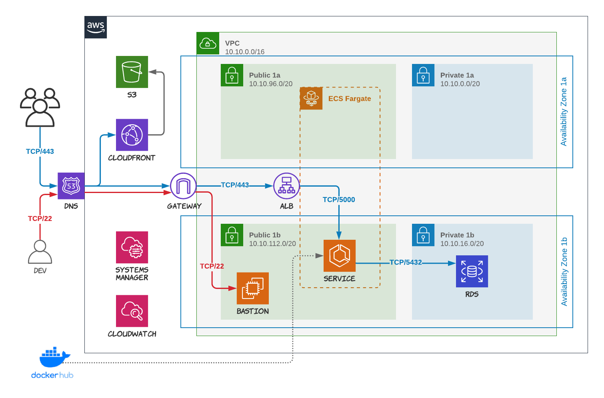

# 311 Data Terraform

This Terraform blueprint manages the infrastructure needed to run the 311 Data API project in AWS.

- creates the complete network infrastructure including the VPC, subnets, gateway, network ACLs, and security groups across 2 availability zones
- creates the Postgres RDS instance with the database and credentials (which are stored in a SSM parameter)
- creates the ECS cluster, service and the load balancer

Note that this blueprint only handles the server infrastructure. The client application needs to be provisioned separately (DNS, S3 bucket and CloudFront).

## Diagram



## Assumptions

- AWS account is already created
- A task-definition.json is already loaded to the AWS account
- IAM Role (ecsTaskExecutionRole) already created with SSMReadOnlyAccess AND ECSTaskExecutionRolePolicy applied
- SSL/TLS certificate is already created and loaded to the AWS account
- DNS is manually pointed to the ALB once the deployment is complete

## Deployment

The blueprint is meant to be deployed manually. The person deploying the blueprint will have the AWS CLI installed and a profile with Admin access for the AWS account being used. Use the Terraform commands (init, plan, apply, etc.) to configure the 0.12 version environment and deploy the environment.

### Parameters

The following parameters (at minimum) need to be set in order to run the blueprint. You can use, for example, a .tfvars file for these.

- profile
- account_id
- db_name
- db_username
- db_password
- acm_certificate_arn

## After the Deployment

The environment will be created with a blank database. As a result the application will initially show an error message.

The initial Alembic migration needs to be run then the database populated using the Prefect data pipeline.

The easiest way to do this is with a SSH tunnel to the database using the Bastion server.

### Connecting to the Database via Port Forwarding

To set up port forwarding to the database through the bastion run a SSH command like the following or user a DB client that supports SSH connections.

```bash
ssh -i ~/.ssh/[YOUR SSH KEY] -L 5432:[DB URL]:5432 [EC2 USER]@[BASTION IP]
```
